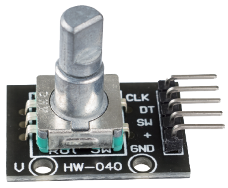

<div align="center">
    <h2>Projeto Encoder</h2>
    
</div>

Realizar a leitura de velocidade de rotação, sentido e quantidade de "ticks" é simples, dificil é a forma como você vai tratar as informações, pois, elas podem estar sujeitas a erros.


<div align="center">

O encoder que estamos utiliazndo possui cinco pinos.
|PINO|NOME|FUNÇÃO|
|:--:|:--:|:--:|
|01  |GND |Polo negativo|
|02  |+   |Polo positivo|
|03  |SW  |Botão        |
|04  |DT  |Saida da primeira onda|
|05  |CLK |Saida da segunda onda |

</div>

```C
    // ARQUIVO MAIN
    // Variáveis globais
    int      speed        = 0,
             flagRotate   = 0;

    int16_t  passCounter  = 0,
             position     = 0;

    uint32_t atualCounter = 0;

    // Função encoder
    void Encoder_manager(void){
        atualCounter = __HAL_TIM_GET_COUNTER(&htim2);

        if (atualCounter > passCounter){
            flagRotate = 1;
            passCounter = (int16_t)atualCounter;

        } else if (atualCounter < passCounter){
            flagRotate = -1;
            passCounter = (int16_t)atualCounter;
        }

        else flagRotate = 0;
    }
```

```C
    // ARQUIVO stm32f1xx_it.c
    // Variáveis globais
    extern int16_t position;
    extern int     speed;

    int16_t oldPos = 0;
    int     indx   = 0;

    // Função manipulador SysTick 
    // É chamado a cada milissegundo
    void SysTick_Handler(void) {
        indx++;

        if (indx == 500) {
            speed  = ((position - oldPos) * 2); // * 2 para evitar falhas na leitura
            oldPos = position;
            indx   = 0;
        }

        HAL_IncTick();
    }
```

