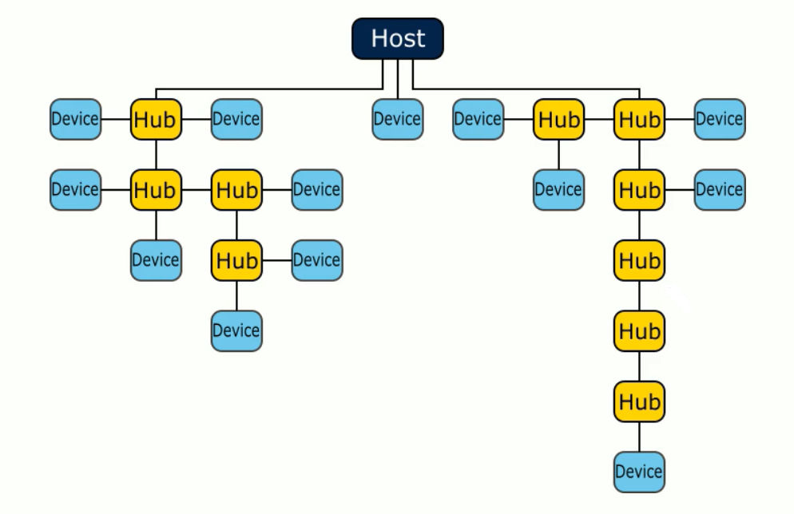

## USB

### Caracteristicas

Conforme a evolução dos computadores emergia, a necessidade de uma padronização das portas dos perifericos surgiu, foi então que a universal serial bus (USB) que possuia como objetivo principal, a modularidade, a facilidade e a padronização das conecções, ela foi desenvolvida como colaboração de algumas empresas que na época eram pioneiras no setor de tecnologia. O USB passou ao longo dos anos por algumas atualizações, cada uma com uma grande evolução em comparação com a outra.

- USB 1.0 (1995): Primeira versão, permitia uma comunicação entre 1.5 a 12 Mbit/s, porém por lmitações de energia e temporização, ele não permitia o uso de cabos de extensão. Fato curioso, a popularização do USB ocorreu apenas na versão 1.1.

- USB 2.0 (2000): Houve um grande salto evolutivo, o USB 2.0 conseguia operar em velocidade de até 480Mbit/s. sem falar que a partir desta versão ele começou a fornecer suporte para carregamento de baterias com correntes de ate 1.5A.

- USB 3.0 (2008): Aqui o modo SuperSpeed surgiu, alcançando taxas de transferencia de até 5Gbit/s e sua capacidade de carregamento também foi aprimorada com correntes que variam de 150mA a 900mA

Com o passar dos anos, novas portas serão produzidas. Sendo que os dispositivos agora possuem uma entrada padronizada. Existem, portanto, formatos e tipos de USB.

- USB Tipo A: É o conector USB comum. Possui um formato retangular e normalmente possui 4 pinos metálico sobre uma base de plástico ou cerâmica. Foi utilizado deste a versão 1.0 até a 3.1. As versões mais recentes do USB deixaram de usar este tipo de conector.

- USB Tipo B: Um pouco menos comun no dia a dia, o tipo B é frequentemente encontrado em impressoras, especialmente as jado de tinta. Tem formato quase quadrado, com cortes angulados de 45° nos cantos superiores.

- USB Tipo C: Esta é o novo padrão, possui um formato ovalado semelhante a uma cápsula, pode conter até 12 pinos. seu tamanho reduzido e versatilidade fizeram com que se tornasse muito popular em dispositivos eletrônicos modernos e computadores.

Existem algumas velocidades, como ja foi mencionado anteriormente, que a USB consegue comunicar, cada dispositivo comunica-se através de uma velocidade seleta na hora do desenvolvimento. Não é obrigatório a utilização de uma determinada velocidade para aquele componente em especifico, *afinal de contas o USB possui uma caracteristica de integrar as velocidades como um todo*¹. É interessante, portanto, selecionar uma velocidade que melhor se encaixa no que você deseja. Visando se ela é mais rápida ou mais lenta do que o esperado.

- ***Low Speed (1.5 Mb/s)***: Ideal para periféricos simples, como mouse e teclado.
- ***Full Speed (12 Mb/s)***: Usada para dispositivos de áuido e comunicação, como microfones e celulares.
- ***High Speed (480 Mb/s)***: Voltada para aplicações mais exigentes, como impressoras, câmeras e armazenamento de dados.

> ¹ Apesar das diferenças técnicas o protocolo USB garante alta compatibilidade entre as velocidades (para o usuário), tudo funciona de forma integrada e sem complicações

### Componentes de comunicação

Existem ao todo três elementos principais: 

1. ***HOST***: É único em cada sistema USB e possui a função de inicializar todas as comunicações e transferencias de dados.
1. ***DEVICE***: É o dispositivo final da comunicação, realizando a função desejada pelo usuário como teclado mouse ou microfone.
1. ***HUB***: Atua como uma ponte entre o host e vários dispositivos. Possui: uma porta *upstream* (que se conecta diretamente ou via outro hub ao host). E várias portas *downstream* (para conectar dispositivos diretamente ou por meio de outros hubs)

    <h3>Formas de conexão permitidas</h3>
     

Existem também algumas topologias de conexões para que possamos utilizar multiplos dispositivos. Um exemplo delas é a tired star.

#### Tired Star 
A conexão física do USB segue esta topologia com cada "estrela" (hub) no centro.

1. Uma porta upstream conectada (diretamente ou indiretamente) ao host
1. Uma ou mais portas downstream conectadas a dispositivos (funções) ou outros hubs.
1. É possível conectar até 127 dispositivos a um único host, com no máximo 5 hubs em série.

Existem dois tipos de dsipositivos quanto à alimentação.

- Bus-powered: Dependem exlusivamente da energia vinda pela porta USB (do host ou hub)

- Self-powered: Possuem fonte de energia própria, funcionamento indemententemente do barramento USB.

### Sistema de configuração

O USB possui um mecanismo inteligente que detecta a qualquer instante a conexão ou desconexão entre dispositivos.

- Device attachment (Conexão de dispositivo): Quando um novo dispositivo é conectado, o host detecta essa conexão automaticamente. Em seguida, ele ativa a porta correspondente, atribui um endereço único ao dispositivo e inicia uma comunicação para identifiar se trata-se de uma função (como teclado, mouse, etc) ou de um hub.

- Device detachment (Desconexão de dispositivo): Ao remover um dispositivo, a porta relacionada é imediatamente desativada. Se o dispositivo removido for um hub, todas as portas dos dispositivos que estavam conectados a ele também são desativadas assim como a porta upstream deste hub

- Bus enumeration (Enumeração do barramento): Esse é o processo contínuo, tanto de hardware quanto de software, que permite ao host gerenciar a conexão e desconexão de dispositivos em tempo real. Ele também garante que, ao remover um dispositivo, todas as etapas necessárias sejam concluídas corretamente.

### Classes

As classes USB são categorias padronizadas que indicam a função de um dispositivo. Elas permitem que um host (como um computador) reconheça automaticamente o tipo de dispositivo conectado e carregue o driver apropriado.

Exemplos de classes USB:

- HID (Human Interface Device): Tudo aquilo que conseguimos manipular.
- Mass Storage: Armazenamento
- Audio.
- CDC (Communication Device Class): Conversores USB-serial, modems.
- MTP/PTP: Câmeras e dispositivos multimídia.

### Transferencia de dados

A comunicação USB é baseada em quatro principais tipos de transferencia:

1. Transferência de controle: utilizada principalmente para a configuração inicial de um dispositivo recém-conectado.

1. Transferencia em massa (Bulk): Ideal para o envio ou recebimento de grandes volumes de dados. 

1. Transferencia por interrupção: Usada para pequenas quantidades de dados que exigem baixa ***latência***².

1. Transferência Isócrona: Aplicada em casos com requisitos de tempo real, como áudio e vídeo contínuos.

>² Latência: Tempo entre uma solicitação e recebimento de resposta.

O Host sempre inicializará a troca de dados. A transferência pode ocorrer em dois sentidos, mas sempre com o host como referência.

1. Data OUT: Do host para o dispositivo.
1. Data IN: Do dispositivo para o host.

Cada transferência, independentemente do tipo, é composta por uma ou mais transações, que seguem até três fases:

- Token: Indica a transação com informações como tipo e direção dos dados.
- Data: Fase opcional onde os dados são efetivamente enviados
- Handshake: Também opcional, confirma se os dados foram recebidos com sucesso.

Todas as requisições USB seguem um formato padrão com os campos bem definidos, seu tamanho, valor e significado, são conhecidos tanto pelo host quanto pelo dispositivo.

- O host preenche e envia esses campos.
- O dispositivo apenas recebe a requisição e a decodifica, preparando-se para a próxima fase da comunicação.

#### Descritores
Um descritor é um conjunto de blocos de dados armazenados na memória do dispositivo, organizados de forma padronizada, tanto o host quanto o dispositivo conhecem essa estrutura.

- Alguns descritores são obrigatórios, o host não consegue continuar a comunicação se estiverem ausentes.

- Outros são opcionais e variam conforme as funcionalidades do dispositivo
- Cada descritor contém informações detalhadas sobre o dispositivo e é enviado ao host em resposta a uma requisição específica.

#### EndPoint
Um endpoint é um buffer de dados (origem ou destino) implementado no dispositivo. Todo dado enviado ou recebido pelo host passa por um endpoint. Cada endpoint é definido por um número e uma direção.

- IN EndPoint: Envia dados do dispositivo para o host
- OUT EndPoint: Recebe dados do host para o dispositivo

Para um mesmo número, existem dois endpoints, um IN e outro OUT, que tratam dados em sentidos opostos.

Tipos de endpoints em um dispositivo:

- Endpoint 0: Sempre presente, par IN/OUT dedicado à transferência de controle. É essencial para a inicialização da comunicação.

- Outros endpoints: São configurados após negociação entre o host e o dispositivo, podendo assumir diferentes tipos de transferência (bulk, isócrona, interrupção etc.).

### Enumeração e Endereço

Cada dispositivo USB recebe um endereço único, atribuído pelo host, variando de 1 a 127. Inicialmente, todo dispositivo recêm-conectado utiliza o endereço 0, até que o host atribua um novo endereço durante a configuração.
- Enumeração (Enumeraion): A enumeração é o processo que garante o controle do status do dispositivo e a gestão em tempo real, de conexões e desconexões.

Esse processo envolve uma negociação entre hardware e software, onde o host indentifica o tipo e as capacidades do dispositivo.

No lado do dispositivo, o software é responsável por: 
- Receber e decodificar as requisições do host.
- Ajustar seu estado interno conforme as instruções recebidas.

### Status do dispositivo

Do momento em que é conectado até estar totalmente funcional, o dispositivo USB passa por vários estágios sequenciais:

- Attached (Conecttado): Dispositivo fisicamente conectado mas sem alimentação.

- Powered (Alimentado): Dispositvo está alimentado, mas não foi inicializado.

- Default (Padrão): Após o reset feito pelo host, o dispositivo opera com velocidade adequada e usa o endereço 0.

- Addressed (Endereçado): O host atribui um endereço único ao dispositivo de 1 a 127.

- Configured (Configurado): O dispositivo recebe uma configuração válida do host e está pronto para operar.

- Suspended (Suspenso): Se não houver tráfego USB por um tempo, o host força o dispositivo a entrar em modo de economia de energia.
 
